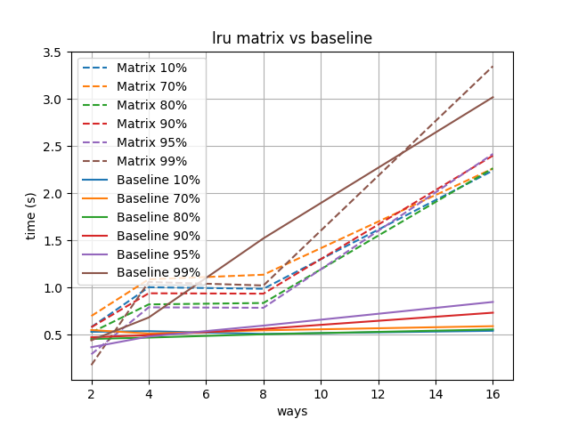

# lru
Quick hack to compare two software implementations of lru.

The first implementation is somehow trivial: there is a single counter whose value is assigned to a way when the way is accessed, and the counter is incremented.
Then, when looking for a way to evict, we simply traverse all the ways looking for the one with the lowest value.
Having a `uint64_t` counter leads to very infrequent non-lru replacements.
This is the implementation used in, e.g., the cache plugin of QEMU.

The second implementation mimics the matrix algorithm used in harware for maintaining an lru policy.
It uses the tricks that is described in Chapters 7 and 6 of Hacker's Delight to work within a register.
Going up to 16-ways means working on 256-bit values, not natively supported neither by the hardware (although I didn't check the SIMD extensions available nowadays) nor by the compiler.

Overall the results are not what I would have expected: the trivial approach beats the matrix one clearly, ...

I first used `random()` to select the ways, but the function eats up too much time, so I went for a trivial increment, although the compiler does not seem to over-optimize the stuffs.

Use the `do-test.sh` script (with `python` and `matplotlib` installed) to reproduce the curves on your own computer.
